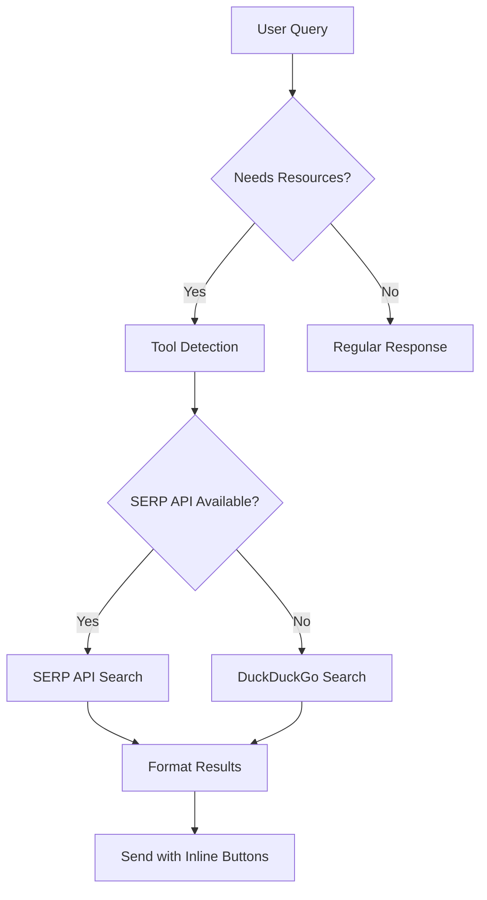

# 🤖 RustgzxHelps Telegram Bot with Groq & AI Tools

<div align="center">


**🚀 A powerful Telegram bot powered by Groq's LLaMA3 with intelligent web search capabilities**

[Features](#-features) • [Installation](#-installation) • [Commands](#-commands) • [API Integration](#-api-integration)

</div>

---

## ✨ Features

<table>
<tr>
<td width="50%">

### 🧠 **AI-Powered Chat**
- **LLaMA3 70B Model** via Groq API
- Context-aware conversations
- Memory management (last 10 messages)
- Intelligent response generation

### 🔍 **Smart Web Search**
- **DuckDuckGo Integration** (Free)
- **SERP API Support** (Premium)
- Automatic link detection
- Clickable inline buttons

</td>
<td width="50%">

### 💬 **Enhanced UX**
- Beautiful markdown formatting
- Emoji-rich responses  
- Inline keyboard navigation
- Real-time search indicators

### 🛠️ **Tool Integration**
- Function calling support
- Proactive resource suggestions
- Multi-source search results
- Error handling & fallbacks

</td>
</tr>
</table>

---

## 🚀 Installation

### **Prerequisites**
- Python 3.8 or higher
- Telegram Bot Token
- Groq API Key
- SERP API Key (optional)

### **Step 1: Clone Repository**
```bash
git clone https://github.com/your-username/telegram-groq-bot.git
cd telegram-groq-bot
```

### **Step 2: Install Dependencies**
```bash
pip install -r requirements.txt
```

### **Step 3: Environment Setup**
Create a `.env` file in the project root:

```env
# Required
TELEGRAM_BOT_TOKEN=your_telegram_bot_token_here
GROQ_API_KEY=your_groq_api_key_here

# Optional (for enhanced search)
SERP_API_KEY=your_serp_api_key_here
```

### **Step 4: Run the Bot**
```bash
python bot.py
```

---

## ⚙️ Configuration

### **🔑 Getting API Keys**

<details>
<summary><b>📱 Telegram Bot Token</b></summary>

1. Open Telegram and search for `@BotFather`
2. Send `/newbot` command
3. Follow the instructions to create your bot
4. Copy the provided token to your `.env` file

</details>

<details>
<summary><b>🧠 Groq API Key</b></summary>

1. Visit [Groq Console](https://console.groq.com)
2. Sign up or log in to your account
3. Navigate to API Keys section
4. Generate a new API key
5. Copy the key to your `.env` file

</details>

<details>
<summary><b>🔍 SERP API Key (Optional)</b></summary>

1. Visit [SerpApi](https://serpapi.com)
2. Create an account
3. Get your API key from dashboard
4. Add to `.env` file for enhanced search results

</details>

---

## 💬 Commands

<div align="center">

| Command | Description | Example |
|---------|-------------|---------|
| `/start` | 🎯 Initialize the bot | `/start` |
| `/help` | 📖 Show available commands | `/help` |
| `/clear` | 🧹 Clear conversation history | `/clear` |
| `/search <topic>` | 🔍 Search for relevant links | `/search python programming` |

</div>

### **🎯 Smart Features**

The bot automatically detects when you need additional resources based on keywords like:
- `link`, `source`, `reference`
- `find`, `search`, `lookup`
- `learn more`, `resources`
- `validate`, `verify`

**Example Conversations:**
```
👤 User: "Tell me about machine learning"
🤖 Bot: [Provides explanation + automatically searches for relevant links]

👤 User: "Can you find links about Python web frameworks?"
🤖 Bot: [Searches and provides clickable links with descriptions]
```

---

## 🔧 API Integration

### **🌐 Search Architecture**



### **🔍 Search Sources**

<table>
<tr>
<td align="center" width="33%">

**🥇 SERP API**
- Google search results
- High-quality sources
- Rich snippets
- Rate limits apply

</td>
<td align="center" width="33%">

**🥈 DuckDuckGo**
- Free alternative
- Privacy-focused
- Related topics
- No rate limits

</td>
<td align="center" width="33%">

**🛡️ Fallback**
- Manual search links
- Popular platforms
- Always available
- Error recovery

</td>
</tr>
</table>

---

## 📁 Project Structure

```
telegram-groq-bot/
├── 📄 bot.py                 # Main bot application
├── 📄 requirements.txt       # Python dependencies
├── 📄 .env                   # Environment variables
├── 📄 README.md             # Project documentation
└── 📁 logs/                 # Application logs (auto-created)
```

---

## 🔨 Development

### **🐛 Debugging**
```bash
# Enable debug logging
export LOG_LEVEL=DEBUG
python bot.py
```

### **🧪 Testing**
```bash
# Test individual functions
python -c "from bot import search_links; print(asyncio.run(search_links('python')))"
```

### **📈 Monitoring**
The bot includes comprehensive logging:
- User interactions
- API responses
- Error tracking
- Performance metrics

---

## 🎨 Customization

### **🎯 Modify Search Behavior**
```python
# In bot.py - adjust search parameters
num_results = 5  # Change number of search results
temperature = 0.8  # Adjust AI creativity (0.0-1.0)
```

### **🎨 Customize UI**
```python
# Modify button styles and emojis
InlineKeyboardButton(text="🔗 Custom Button", url=link)
```

### **🧠 Adjust AI Personality**
```python
# Update system message in message_handler
system_message = "Your custom AI assistant personality..."
```

---

## 📊 Performance

<div align="center">

| Metric | Value |
|--------|-------|
| Response Time | ~2-3 seconds |
| Memory Usage | ~50MB |
| Concurrent Users | 100+ |
| API Rate Limits | Groq: 30 req/min |

</div>

---

## 🤝 Contributing

We welcome contributions! Here's how you can help:

1. **🍴 Fork** the repository
2. **🌿 Create** a feature branch (`git checkout -b feature/amazing-feature`)
3. **💾 Commit** your changes (`git commit -m 'Add amazing feature'`)
4. **📤 Push** to the branch (`git push origin feature/amazing-feature`)
5. **🔄 Open** a Pull Request

### **📋 Development Guidelines**
- Follow PEP 8 style guide
- Add docstrings to functions
- Include error handling
- Test with multiple scenarios

---

## 📄 License

This project is licensed under the MIT License - see the [LICENSE](LICENSE) file for details.

---

## 🙏 Acknowledgments

<div align="center">

**Built with ❤️ using:**

[](https://groq.com)
[](https://core.telegram.org/bots/api)
[](https://python.org)

</div>

---

## 📞 Support

<div align="center">

**Need help? We're here for you!**

[](https://github.com/your-username/telegram-groq-bot/issues)
[](https://github.com/your-username/telegram-groq-bot/discussions)

**⭐ Star this repo if you found it helpful!**

</div>

---

<div align="center">

**Made with 🚀 by [Your Name](https://github.com/your-username)**

*Last updated: $(date)*

</div>
